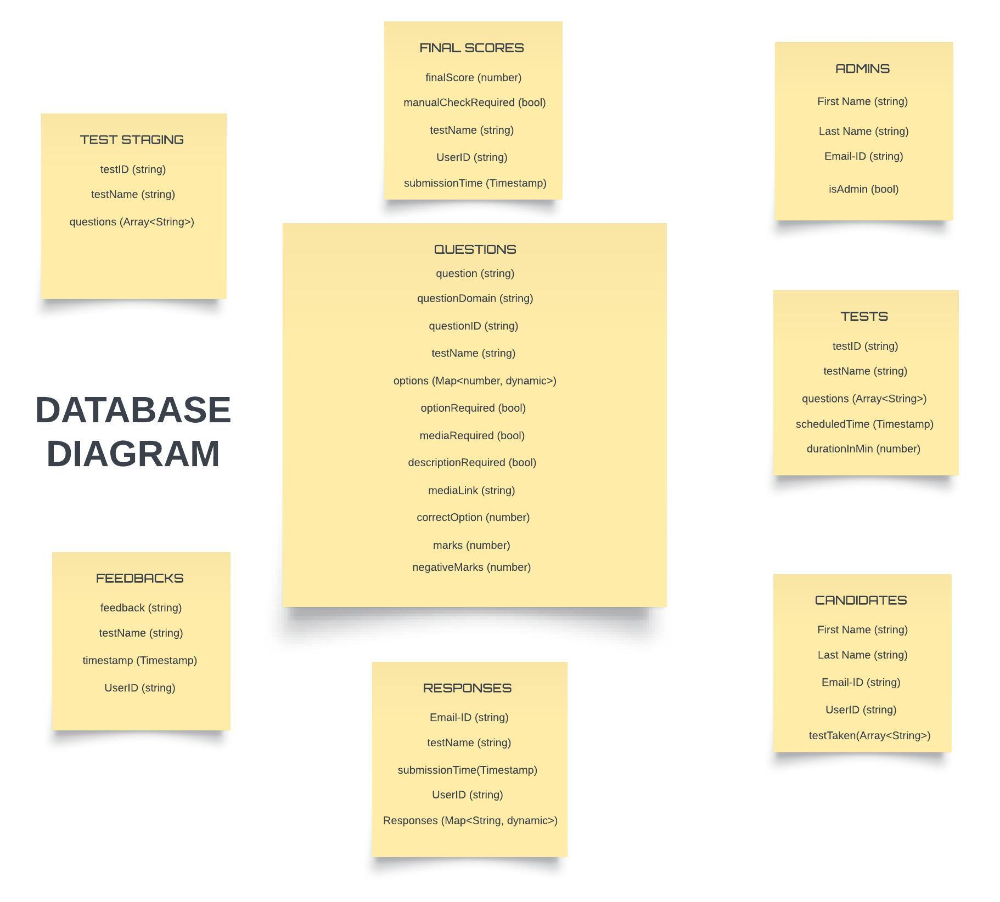

#  Intelliquiz (SDS Online Aptitude Test System)

This project is developed for the Software Development Section (SDS) under COEP Tech University to conduct online aptitude tests for students. The application is designed with role-based authentication to provide a seamless and secure testing experience.

## Features

- **Role-Based Authentication**: Three roles are implemented:
  - **Root**: Can add or remove admins and manage the overall system.
  - **Admin**: Has privileges to view all candidates, create tests in the test staging area, and manage questions.
  - **Candidate**: Can view and take scheduled tests.

- **Test Management**:
  - Admins can create tests that include multiple-choice or descriptive questions.
  - Questions can include media (images, videos) uploaded to cloud storage, with reference links stored in Firestore.

- **Timed Tests**: Tests are scheduled and automatically submitted when the time limit is reached.

- **Score Calculation**: Cloud Functions compute final scores based on candidate responses and write the results back to the database, including a boolean flag indicating if manual checks are required.

- **Manual Review**: Admins can review and update scores for candidates flagged for manual review.

- **Final Score Release**: Once the review process is completed, final scores are released to the candidates.

- **Additional Features**:
  - Password recovery for users.
  - Candidate feedback submission.
  - Secure registration for admins using an admin access code stored in Firestore.

## Database Diagram



## Installation

1. **Clone the Repository**:
   ```bash
   git clone <repository-url>
   cd <project-directory>

2. **Install Dependencies**:
    ```bash
    flutter pub get
    ```
3. **flutter run**:
    ```bash
    flutter run
    ```
## Project Link
Hosted on GCP(Google Cloud Platform) 
## Usage
**Admin Registration**:
Navigate to the common registration page.
Enter the admin access code (if applicable) to register as an admin.

**Test Creation**:
Admins can create tests and manage questions through the admin panel.

**Candidate Participation**:
Candidates can log in and view scheduled tests.
Tests can be taken within the given time frame.

**Review Process**:
Admins can review candidate responses and manually update scores as needed.

## Contributing
Contributions are welcome! If you have suggestions for improvements or features, feel free to open an issue or submit a pull request.

## License
This project is licensed under the MIT License. See the LICENSE file for details.

## Acknowledgements
Developed by Aman Morghade
Thanks to the team at COEP Tech University!